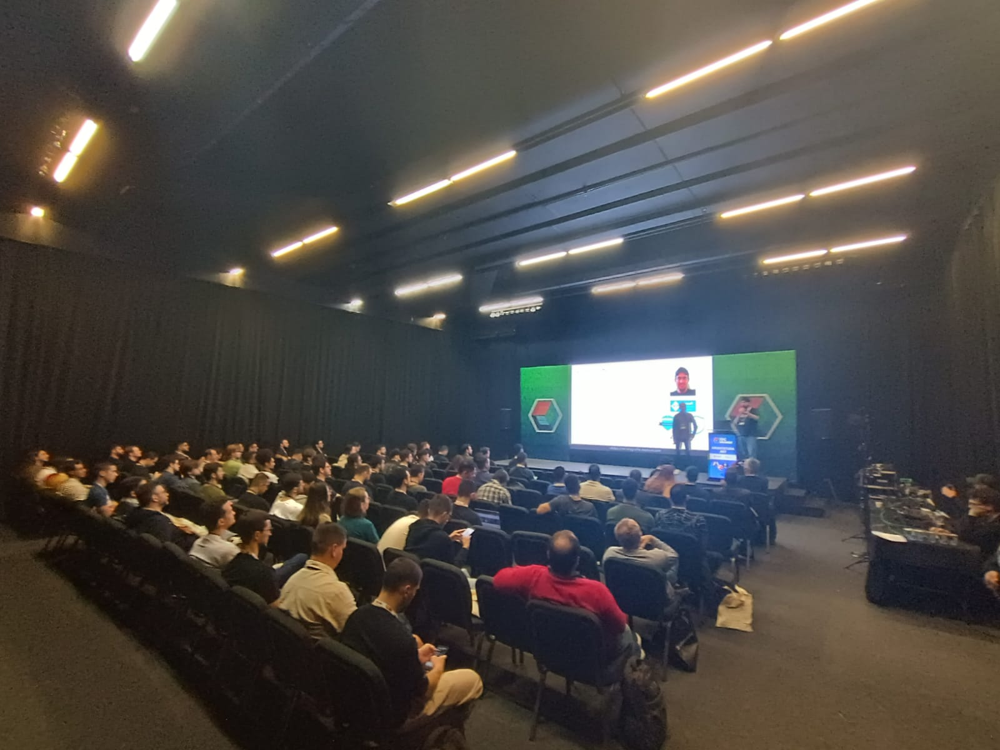
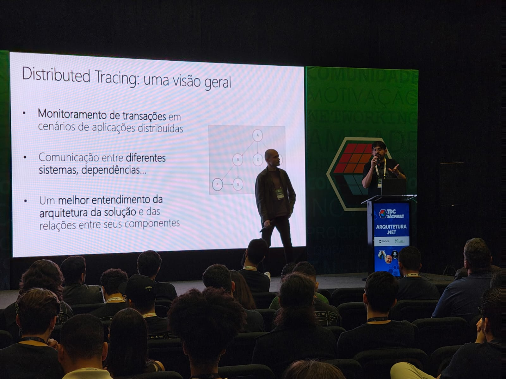
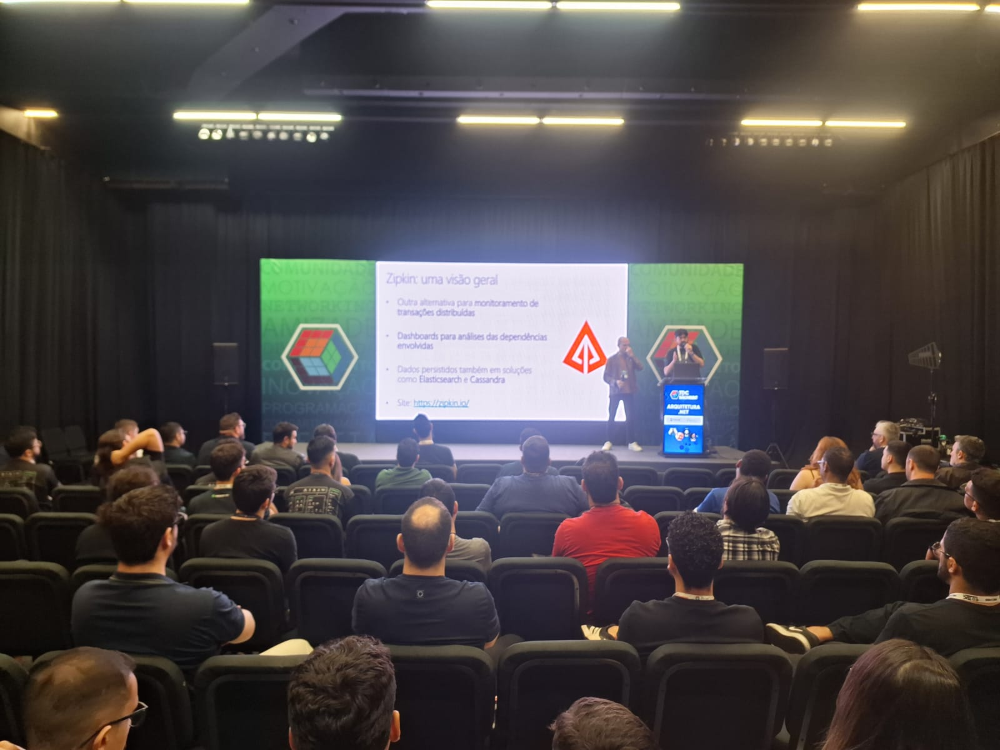
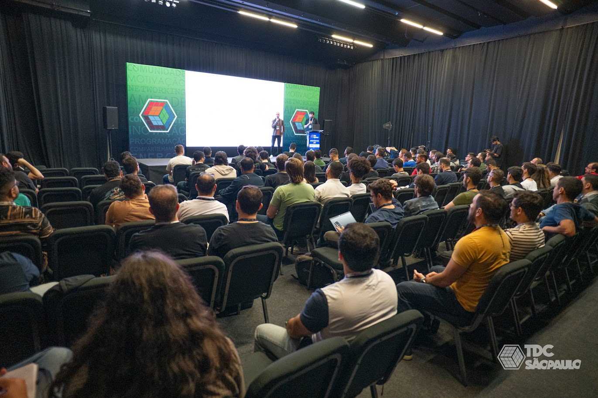
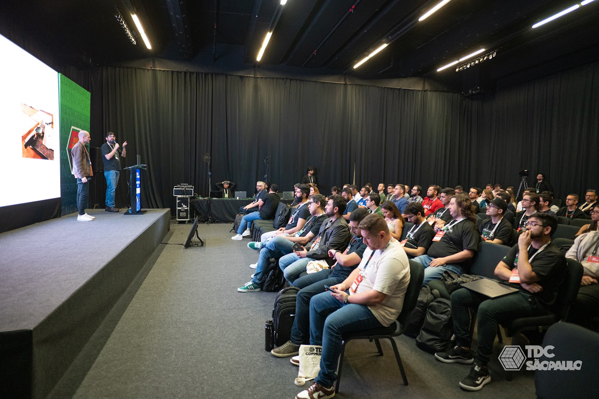
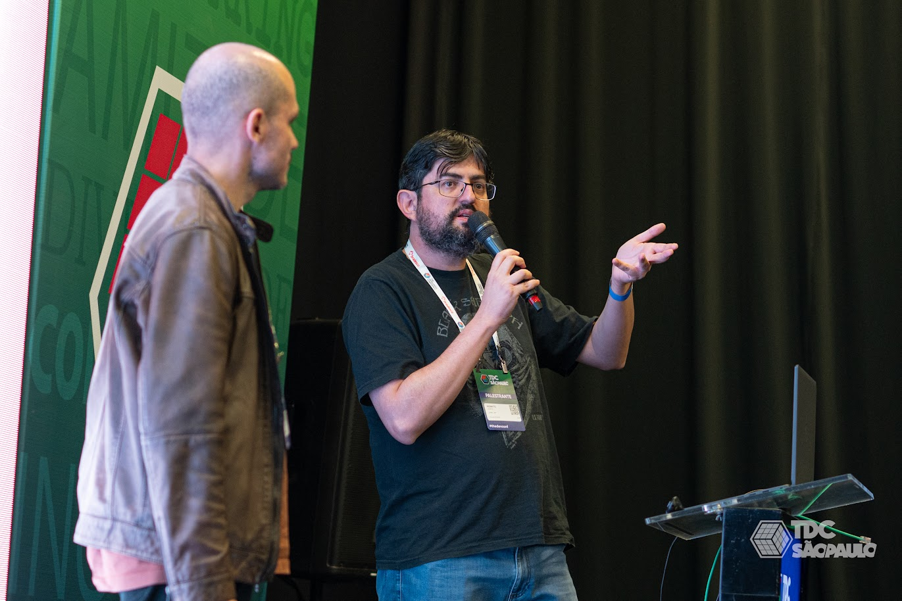
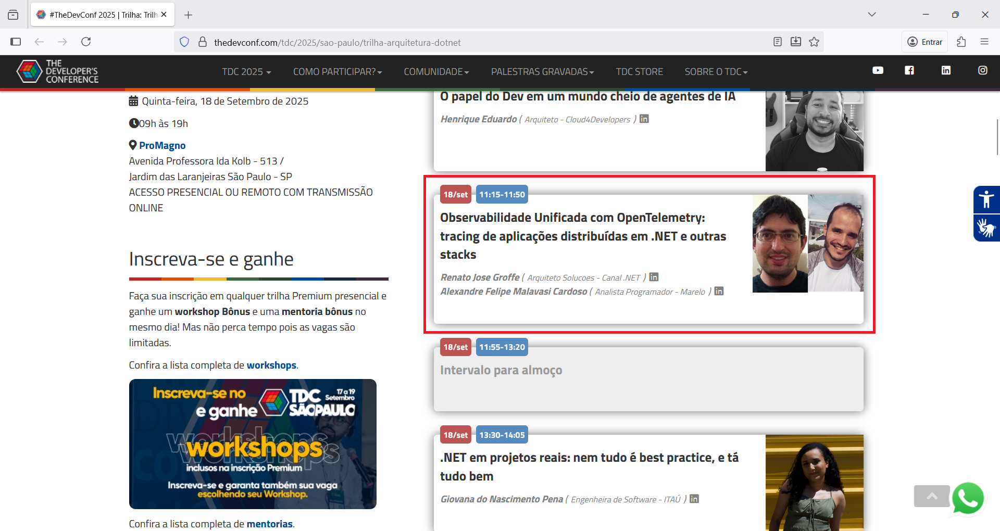

# opentelemetry_tdc-sp-2025
Materiais de apresentação "Observabilidade Unificada com OpenTelemetry: tracing de aplicações distribuídas em .NET e outras stacks" realizada no dia 18/09/2025, durante o TDC São Paulo.

Inclui exemplos utilizando OpenTelemetry com .NET, Java, Node.js, Docker Compose, Grafana, Jaeger, Zipkin, Elastic APM, PostgreSQL, MySQL e Redis.

Palestrantes (links apontando para o LinkedIn, nos adicionem lá 😉):
- Renato Groffe | [LinkedIn](https://www.linkedin.com/in/renatogroffe/) :: [GitHub](https://github.com/renatogroffe)
- Alexandre Malavasi | [LinkedIn](https://www.linkedin.com/in/alexandremalavasi/) :: [GitHub](https://github.com/alexandremalavasi)

Repositorios com os scripts + Docker Compose para a criacao dos ambientes que farao uso do OpenTelemetry, PostgreSQL, MySQL e Redis:
- [Jaeger](https://github.com/renatogroffe/dockercompose-opentelemetry-jaeger-postgres-mysql-redis)
- [Grafana](https://github.com/renatogroffe/dockercompose-opentelemetry-grafana-postgres-mysql-redis)
- [Elastic APM](https://github.com/renatogroffe/dockercompose-opentelemetry-elasticapm-postgres-mysql-redis)
- [Zipkin](https://github.com/renatogroffe/dockercompose-opentelemetry-zipkin-postgres-mysql-redis)

Repositorios com as aplicacoes utilizadas nos testes com tracing distribuido:
- [Console App de orquestracao em .NET 9](https://github.com/renatogroffe/dotnet9-consoleapp-otel-grafana_consumoapis)
- [API que acessa PostgreSQL, MySQL e Redis - .NET 9 + ASP.NET Core](https://github.com/renatogroffe/aspnetcore9-otel-grafana-postgres-mysql-redis_apicontagem)
- [API REST criada com Node.js](https://github.com/renatogroffe/nodejs-otel_apiconsumobackend)
- [API REST criada com Java + Spring + Apache Camel](https://github.com/renatogroffe/java-spring-camel_apiconsumobackend)

Referências:
- OpenTelemetry: https://opentelemetry.io/
- OpenTelemetry + .NET: https://learn.microsoft.com/en-us/dotnet/core/diagnostics/observability-with-otel
- Jaeger: https://www.jaegertracing.io/
- Grafana: https://grafana.com/docs/
- Grafana Alloy: https://grafana.com/docs/alloy/latest/
- Zipkin: https://zipkin.io/
- Elastic APM: https://www.elastic.co/observability/application-performance-monitoring

---

# Informações sobre o evento

Título da apresentação: **Observabilidade Unificada com OpenTelemetry: tracing de aplicações distribuídas em .NET e outras stacks**

Evento: **TDC Summit São Paulo 2025**

Data: **18/09/2025 (quinta-feira)**

Tecnologias e tópicos abordados: **OpenTelemetry, Observabilidade, tecnologias cloud native, containers, Docker, Docker Compose, Kubernetes, Jaeger, Grafana, Grafana Tempo, Loki, Grafana Alloy, Zipkin, Elastic APM, .NET, ASP.NET Core, Java, Spring Boot, Apache Camel, Node.js, Visual Studio Code, Linux, Python, FastAPI...**

Número de participantes: **200 pessoas (estimativa, presencial + online)**

Site do evento: **https://thedevconf.com/tdc/2025/sao-paulo/trilha-arquitetura-dotnet**

Local: **PRO MAGNO Centro de Eventos - Avenida Professora Ida Kolb, 513 - Jardim das Laranjeiras - São Paulo-SP - CEP: 02518-000**

Esta palestra foi realizada em conjunto com meu amigo **Alexandre Malavasi (Microsoft MVP)**.

---

